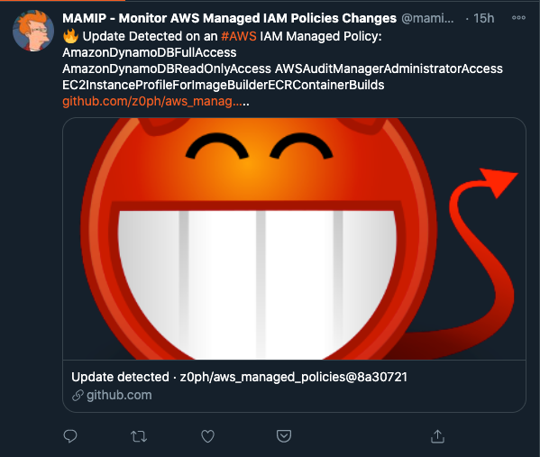
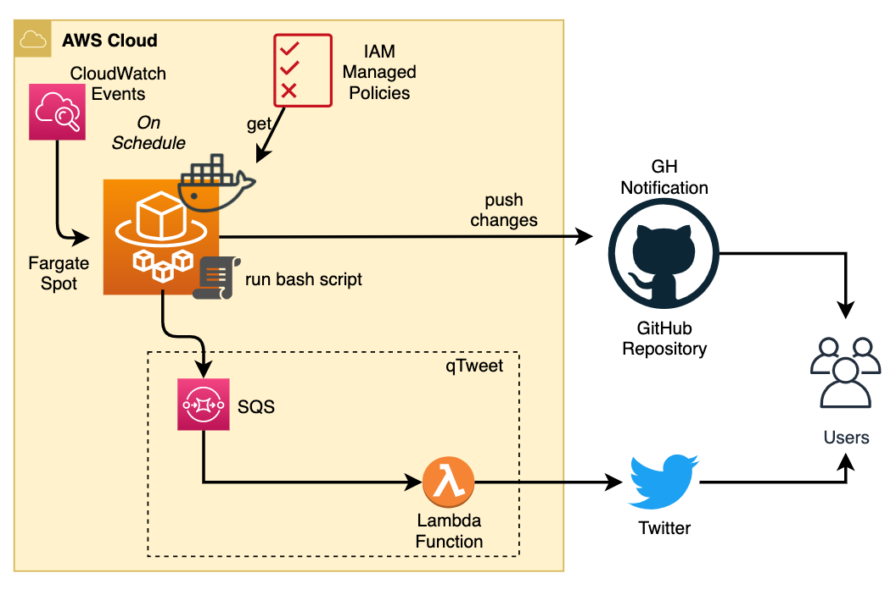

# [MAMIP] Monitor AWS Managed IAM Policies :loudspeaker:

[![[Prod] MAMIP - GitHub Actions](https://github.com/z0ph/aws_managed_policies/actions/workflows/main.yml/badge.svg?branch=master)](https://github.com/z0ph/aws_managed_policies/actions/workflows/main.yml)

Thanks to [@0xdabbad00](https://twitter.com/0xdabbad00) for the original idea, this repo automate the retrieval of new AWS Managed IAM Policies make it easier to monitor and get alerted when changes occur using "Watch" feature of Github or using [Twitter Account](https://twitter.com/mamip_aws).

## :hand: Usage

### Three options

1. Follow the [dedicated Twitter Account](https://twitter.com/mamip_aws).

[](https://twitter.com/mamip_aws)

2. Activate `Releases Only` feature of Github


3. Subscribe to the Github [RSS Feed](https://github.com/z0ph/aws_managed_policies/commits/master.atom) (`master` branch)

## :white_check_mark: Policy Validation

I'm using [AWS Access Analyzer Policy Validation](https://aws.amazon.com/blogs/aws/iam-access-analyzer-update-policy-validation/). You can check findings in the [findings folder](./findings/).

## :white_heart: How it works behind the scene

AWS Managed Policies are acquired as follows:

```bash
aws iam list-policies > list-policies.json
cat list-policies.json \
  | jq -cr '.Policies[] | select(.Arn | contains("iam::aws"))|.Arn +" "+ .DefaultVersionId+" "+.PolicyName' \
  | xargs -n3 sh -c 'aws iam get-policy-version --policy-arn $1 --version-id $2 > "policies/$3"' sh
```

This commands does the following:

- Gets the list of all IAM Policies in the AWS account
- Finds the ones with an ARN containing `iam::aws`, so that only the AWS managed policies are grabbed.
- Gets the `ARN`, current version id, and policy name (needed so we don't have a slash as the `ARN` does for writing a file)
- Calls `aws iam get-policy-version` with those values, and writes the output to a file using the policy name.

### :gear: Automation Details

- Infrastructure is deployed using Terraform:
  - ECS/Fargate
- Clone this repository
- Run the magic (previously mentioned command)
- If changes detected:
  - Commit changes
  - Push (with tags for GH release)
  - Push to [qTweet](https://github.com/z0ph/qtweet)

#### :clock1: Schedule

- ECS/Fargate (Spot): [current setting](https://github.com/z0ph/aws_managed_policies/blob/master/automation/tf-fargate/variables.tf#L66-L69)

### Architecture Design

